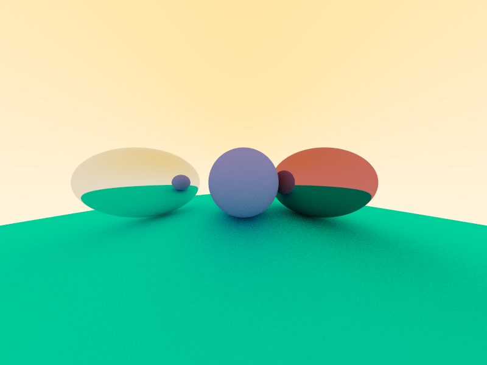

# Assignment 5: Ray tracing

本次作业使用平台：Windows	IDE：DEVC++

## Task1

直接编译运行代码，生成如下的图片：


### 1.1 光线、简单的照相机和背景

首先是光线的表示。光线可以由两个点A和B形成的射线表示，其中A为射线发出的原点，B为光线指示传播方向。射线上任何一点可以表示为$p(t)=A+tB$，其中t为常数。当$t\geq 0$时，光线方向为AB方向，否则为反向。

创建`ray.h`，如下所示：

```cpp
#ifndef RAYH
#define RAYH
#include "vec3.h"

class ray{
	public:
		ray(){}
		ray(const vec3& a, const vec3& b){A=a;B=b;};
		vec3 origin() const {return A;}			// 返回原点，即点A
		vec3 direction() const {return B;}		// 返回方向，即点B
		vec3 point_at_parameter(float t) const {return A + t*B;}	// 给定t值求位置

		vec3 A;
		vec3 B;
};

#endif
```

由此可以表示任何一条光线。

默认观察视点在原点，方向朝向z轴负方向，上方朝y轴正方向。故设置A值为(0,0)，定义好屏幕范围后，将屏幕等比例与图片像素一一对应，就能得到每个像素在屏幕上对应的点。将得到的这些点作为B值，就能得到每个像素发出的光线了。

在`PathTracer::render`里定义屏幕为z=-1的平面，考虑到输出图片的大小800 * 600，设置屏幕的x范围为[-4, 4]，y范围为[-3, 3]，并定义原点，代码如下：

```cpp
vec3 lower_left_corner(-4.0, -3.0, -1.0);
vec3 horizontal(8.0, 0.0, 0.0);
vec3 vertical(0.0, 6.0, 0.0);
vec3 origin(0.0, 0.0, 0.0);
```

其中`lower_left_corner`为屏幕左下角的点，`horizontal`和`vertical`分别代表了该点能够向水平方向和竖直方向延伸的距离。通过像素点位置比长和宽，就能知道当前像素点对应的屏幕位置。在渲染每个像素时，使用以下代码确定像素在屏幕上的位置：

```cpp
float u = static_cast<float>(col) / static_cast<float>(m_width);
float v = static_cast<float>(row) / static_cast<float>(m_height);
```

如此一来，像素点的位置就在`lower_left_corner + u*horizontal + v*vertical`处。以该点为B点，原点为A点，就能创建光线对象：

```cpp
ray r(origin, lower_left_corner + u*horizontal + v*vertical);
```

得到光线后，我创建了一个函数`calcColor`通过光线来计算光线对应的像素显示的颜色。函数原型为：

```cpp
vec3 calcColor(ray &r);
```

这里生成简单的背景颜色：将光线B点的值单位化，其y值+1.0再除以2得到`t`。因为单位化后向量y值取值范围为[-3, 3]，故`t`的取值范围为[0, 1]。将`t`和`1-t`作为权重，让背景颜色在`(1.0, 1.0, 1.0)`（全白）和`(1.0,0.8,0.4)`（橘色）之间变换：

```cpp
vec3 calcColor(ray &r){
    // 生成背景颜色
	vec3 unit_direction = unit_vector(r.direction());
	float t = 0.5 * (unit_direction.y() + 1.0) ;
	return (1.0-t)*vec3(1.0,1.0,1.0) + t*vec3(1.0,0.8,0.4);
}
```

编译运行得到以下结果：


### 1.2 球的加入

在三位空间中，球可以用球心坐标$(x_c, y_c, z_c)$和半径`R`表示。球上任意一点$(x, y, z)$满足$(x-x_c)^2+(y-y_c)^2+(z-z_c)^2=R^2$。使用向量形式表达，记圆心为$\bold C$，圆上一点为$\bold P$，则可以表达为：$(\bold C-\bold P)\cdot (\bold C-\bold P)=R^2$。要判断光线是否与圆相交，只需要将光线的方程$\bold A+t\bold B$代入$\bold P$值，看方程是否有解。代入后化简得到：
$$
(\bold B\cdot\bold B)t^2+2(\bold B\cdot(\bold A-\bold C))t+(\bold A-\bold C)\cdot(\bold A-\bold C)-R^2=0
$$
这是一个一元二次方程，只要使得其判别式大于零则有解，等于零是特殊情况：光线与球相切，这里认为相切的情况不算光线与球有交点。由此，可以写出一个判断光线是否与球产生交点的函数：

```cpp
bool hit_sphere(const vec3& center, float radius, const ray& r) {
    vec3 oc = r.origin() - center;
    float a = dot(r.direction(), r.direction());
    float b = 2.0 * dot(oc, r.direction());
    float c = dot(oc, oc) - radius*radius;
    float discriminant = b*b - 4*a*c;
    return (discriminant > 0);
}
```

其中，`a`、`b`、`c`分别为上述一元二次方程的系数，判别式为$b^2-4ac$。若判断式大于0则返回`true`，否则返回`false`。

有了该函数，就能判断之前讨论的每个像素引出的光线是否与某个球相交了。修改`clacColor`函数，若光线与圆心为$(0,0,-2)$、半径为1.5的球相交，则输出对应的颜色$(0.7,0.8,0.9)$：

```cpp
vec3 calcColor(ray &r){
    // 若与球相交，则输出球的颜色
	if (hit_sphere(vec3(0,0,-2), 1.5, r))
        return vec3(0.7,0.8,0.9);
    // 否则输出背景颜色
	vec3 unit_direction = unit_vector(r.direction());
	float t = 0.5 * (unit_direction.y() + 1.0) ;
	return (1.0-t)*vec3(1.0,1.0,1.0) + t*vec3(1.0,0.8,0.4);
}
```

这样就能成功显示球了：


需要注意的是，如果按照教程中所给的屏幕参数：

```cpp
vec3 lower_left_corner(-2.0, -1.0, -1.0);
vec3 horizontal(4.0, 0.0, 0.0);
vec3 vertical(0.0, 2.0, 0.0);
```

会得到以下错误的结果：


因为输出图片的像素数量为800*600，按照教程中2:1的屏幕大小设置屏幕会导致非等比例的映射，出现图片变形的情况。因此我重新设置的x范围为[-4, 4]，y范围为[-3, 3]，从而保证长宽比和输出图片相同。为了让球显示的更加自然，我也更改了球的参数。

```cpp
vec3 lower_left_corner(-4.0, -3.0, -1.0);
vec3 horizontal(8.0, 0.0, 0.0);
vec3 vertical(0.0, 6.0, 0.0);
```

### 1.3 表面法向量和多个物体

球表面的法向量很好求：球上任意一点P减去球心C得到的就是P点的法向量方向，单位化后就得到了要求的法向量。在上述的模型中，光线和求相交得到的一元二次方程可以求解出`t`的值，将`t`值代入光线方程就能得到光线和球的交点，从而可以计算出该点的法向量。所以可以修改上述的`hit_sphere`函数，返回求解得到的`t`值。暂时不考虑球的部分出现在$z>0$的情况，考虑到$(\bold B\cdot\bold B)$的值必然大于0，视线首先看到的点，或者说光线首先照射到的点，必然是`t`值更小的那个点，因此只需要返回减去判别式平方根的那一个解即可。因为这种情况下`t`必然大于0，在没有交点时返回-1即可。修改后的函数如下：

```cpp
float hit_sphere(const vec3& center, float radius, const ray& r) {
    vec3 oc = r.origin() - center;
    float a = dot(r.direction(), r.direction());
    float b = 2.0 * dot(oc, r.direction());
    float c = dot(oc, oc) - radius*radius;
    float discriminant = b*b - 4*a*c;
    // 若无解，返回-1
    if (discriminant < 0) {
	return -1.0;
    }
    // 若有解，返回较小的那一个（减去sqrt(discriminant)的）
    else {
        return (-b - sqrt(discriminant) ) / (2.0*a);
    }
}
```

在得到了`t`值，就可以调用上述的`point_at_parameter(t)`函数求解交点。减去圆心并单位化后就得到了该点的法向量。将法向量的坐标值+1后除以0.5作为该光线对应像素的颜色并返回：

```cpp
vec3 (const ray& r) {
    float t = hit_sphere(vec3(0,0,-2), 1.5, r);
    // 有交点则计算法向量，依据法向量计算颜色
    if (t > 0.0) {
        vec3 N = unit_vector(r.point_at_parameter(t) - vec3(0,0,-2));
		return 0.5*vec3(N.x()+1, N.y()+1, N.z()+1);
    }
    // 输出背景颜色
    vec3 unit_direction = unit_vector(r.direction());
    t = 0.5*(unit_direction.y() + 1.0);
    return (1.0-t)*vec3(1.0, 1.0, 1.0) + t*vec3(0.5, 0.7, 1.0);
}
```

得到如下结果：


在多物体的场景下，为了方便代码编写，将物体封装成类`hitable`，从中继承球的类`sphere`。

创建文件`hitable.h`主要代码如下：

```cpp
struct hit_record{
    float t;
    vec3 p;
    vec3 normal;
};

class hitable{
    public:
        virtual bool hit(const ray& r, float t_min, float t_max, hit_record& rec) const = 0;
};
```

考虑到每条光线可能会与多个物体相交，需要知道这些物体相交的先后顺序，找到最前面的物体，因此每次计算光线相交时需要记录相交处的信息。使用上面的结构体`hit_record`进行记录，保存交点对应的`t`值、交点`p`、法向量`normal`。通过记录当前`t`值，限制最大的`t`值`t_max`，就能合理排除更远处相交的物体。同时还要考虑`t`值为负数，交点在视线后方的情况。为了排除该情况，还需要设置`t`值的下限`t_min`。使用上述`hit`函数来更新交点的记录和`t`值范围。

由此，可以继承得到球的类。在新加头文件`sphere.h`中编写。

```cpp
class sphere: public hitable  {
    public:
        sphere() {}
        sphere(vec3 cen, float r) : center(cen), radius(r)  {};
        virtual bool hit(const ray& r, float tmin, float tmax, hit_record& rec) const;
        vec3 center;
        float radius;
};
```

成员变量`center`和`radius`记录球心和半径。`hit`函数用来判断光线与该球是否有交点，若有则记录交点。具体内容如下：

```cpp
bool sphere::hit(const ray& r, float t_min, float t_max, hit_record& rec) const {
    vec3 oc = r.origin() - center;
    float a = dot(r.direction(), r.direction());
    float b = dot(oc, r.direction());
    float c = dot(oc, oc) - radius*radius;
    float discriminant = b*b - a*c;
    // 若判别式大于0则有交点
    if (discriminant > 0) {
        // 优先考虑更小的t值，因为离摄像机更近
        float temp = (-b - sqrt(discriminant))/a;
        if (temp < t_max && temp > t_min) {
            // 满足t值范围条件则更新rec
            rec.t = temp;
            rec.p = r.point_at_parameter(rec.t);
            rec.normal = (rec.p - center) / radius;
            return true;
        }
        // 若小t值不满足条件则考虑大t值
        temp = (-b + sqrt(discriminant)) / a;
        if (temp < t_max && temp > t_min) {
            rec.t = temp;
            rec.p = r.point_at_parameter(rec.t);
            rec.normal = (rec.p - center) / radius;
            return true;
        }
    }
    return false;
}
```

还需要一个类`hitable_list`来同一管理所有创建的图形，在渲染时依次判断各个图形是否和光线有交点。创建新头文件`hitable_list.h`，`hitable_list`类如下：

```cpp
class hitable_list: public hitable  {
    public:
        hitable_list() {}
        hitable_list(hitable **l, int n) {list = l; list_size = n; }
        virtual bool hit(
            const ray& r, float tmin, float tmax, hit_record& rec) const;
        hitable **list;
        int list_size;
};
```

该类有两个成员变量：`hitable **list`是一个存储所有图形的指针的数组，`list_size`为该数组大小。存储图形对象的指针而不是图形对象本体是因为可以利用虚函数来调用`hitable_list`的`hit`方法，再在其中调用各个图形的`hit`方法。

`hitable_list`的`hit`方法如下：

```cpp
bool hitable_list::hit(const ray& r, float t_min, float t_max, hit_record& rec) const {
    hit_record temp_rec;
    bool hit_anything = false;
    double closest_so_far = t_max;
    // 依次与各个图形求交点
    for (int i = 0; i < list_size; i++) {
        // 若产生的满足条件的交点则更新交点记录
        if (list[i]->hit(r, t_min, closest_so_far, temp_rec)) {
            hit_anything = true;
            closest_so_far = temp_rec.t;
            rec = temp_rec;
        }
    }
    return hit_anything;
}
```

每次判断某一光线照射的物体的时候，`hitable_list`的`hit`方法才会被调用，因此创建一个临时的`temp_rec`变量记录该光线的交点信息。`closest_so_far`初始化为传入的`t_max`，在之后对每一个数组`list`中的图形对象求交点，若有交点，则用交点的`t`值更新`closest_so_far`作为之后的`t_max`，并更新交点记录。最终如果产生了交点则返回`true`，否则为`false`。

经过上述的封装，就能更好地在空间中创建物体了。在渲染函数内加入以下代码：

```cpp
hitable *list[2];
list[0] = new sphere(vec3(0,0,-2), 1.5);
list[1] = new sphere(vec3(0,-101.5,-1), 100);
hitable *world = new hitable_list(list,2);
```

即创建两个球体，球心和半径分别为$(0,0,-2),1.5$和$(0,-101.5,-1),100$。使用`list`来记录这两个图形，由`world`同一进行光线交点的求解。将`calcColor`函数改为：

```cpp
vec3 calcColor(const ray& r, hitable *world){
    hit_record rec;
    // 若产生交点，通过交点法向量生成球面颜色
    if (world->hit(r, 0.0, FLT_MAX, rec)) {
        return 0.5 * vec3(rec.normal.x()+1, rec.normal.y()+1, rec.normal.z()+1);
    } 
    // 否则输出背景颜色
    else {
        vec3 unit_direction = unit_vector(r.direction());
        float t = 0.5*(unit_direction.y() + 1.0);
        return (1.0-t)*vec3(1.0, 1.0, 1.0) + t*vec3(1.0,0.8,0.4);;
    }
}
```

注意这里使用教程代码所给的`MAXFLOAT`会报错，可能是平台的问题。我使用了`<stdlib.c>`里定义的`FLT_MAX`。

结果如下图所示：


### 1.4 抗锯齿处理

在上述模型中，每个像素只由一条光线求得的颜色来表示。在分辨率较低的情况下，这样得到的像素颜色不精确，容易出现锯齿。可以将一个像素想象成一个方形，考虑在一个像素中射出多条光线，用这些光线求得颜色的均值来表示这个像素的颜色，从而更加精确地确定像素颜色。

为了统一表示设计光线操作相关的量，可以设置一个摄像机类。创建新头文件`camera.h`，主要内容如下：

```cpp
class camera {
    public:
        camera() {
            lower_left_corner = vec3(-4.0, -3.0, -1.0);
			horizontal = vec3(8.0, 0.0, 0.0);
			vertical = vec3(0.0, 6.0, 0.0);
			origin = vec3(0.0, 0.0, 0.0);
        }
        ray get_ray(float u, float v) {
            return ray(origin,lower_left_corner + u*horizontal + v*vertical - origin);
        }
        vec3 origin;
        vec3 lower_left_corner;
        vec3 horizontal;
        vec3 vertical;
};
```

可以看到，`camera`类保存了之前设定的屏幕信息，并且`get_ray`函数能够通过给出的屏幕坐标`u`和`v`返回光线。

设定每个像素的光线数`ns = 100`，在渲染每一个像素时通过生成随机数来生成经过该像素的不同方向的光线，最终计算颜色均值：

```cpp
vec3 color(0,0,0);
for (int s=0; s < ns; s++) {
    float u = float(static_cast<float>(col) + (rand()%1000)/1000.0) / static_cast<float>(m_width);
    float v = float(static_cast<float>(row) + (rand()%1000)/1000.0) / static_cast<float>(m_height);
    ray r = cam.get_ray(u, v);
    color += calcColor(r, world);
} 
color /= ns;
```

在我的环境下不支持教程所给的`drand48()`函数生成随机浮点数，因此我使用了`rand()`函数生成随机整数，模1000保证了数的范围为0到999。再除以1000.0，就能模拟随机生成$[0,1)$范围内的浮点数。

抗锯齿前的大图和抗锯齿处理后得到的结果如下图所示：


放大后可以很明显地看出抗锯齿处理前后的变化：


## Task 2

### 2.1 漫反射材质

漫反射的材质是凹凸不平的，因此当光线照射上去时会随机往一个方向传播。当然，传播的方向是向表面外而不是表面内。为了得到随机的光线方向，考虑在光线交点的单位法向量处作一个半径为1的球（下面称为单位球）。因为法向量长为1，而单位球半径为1，所以单位球一定与光线照射到的那个球体相切。也就是说，单位球内任意一点不会出现在照射的球体内部。因此可以在单位球内找随机一点S，将照射点P到S的方向作为漫反射的光反射方向。

生成单位球内一点：

```cpp
vec3 random_in_unit_sphere() {
    vec3 p;
    do{
    	p = 2.0 * vec3((rand()%1000)/1000.0,(rand()%1000)/1000.0,(rand()%1000)/1000.0) - vec3(1,1,1);
	}while(p.squared_length() >= 1.0);	// 到球心的距离大于等于1则重新生成
	return p;
}
```

需要注意的是重新生成的条件包括等于1.0，也就是在球面上。如果生成点能够在球面上，这样一来有可能生成的点和交点相同，算出的反射方向为$(0,0,0)$，导致未知错误。

用`target`表示单位球上的点的世界坐标，递归调用`calcColor`计算漫反射后的光线。前面的系数0.5表示漫反射系数，经过漫反射后光照强度变为原来的50%。

```cpp
vec3 target = rec.p +rec.normal + random_in_unit_sphere();
return 0.5 * calcColor(ray(rec.p, target-rec.p), world);
```

运行得到如下结果：


接着对颜色进行伽马校正，即在得出像素颜色值后，每个颜色通道开方：

```cpp
color = vec3(sqrt(color[0]),sqrt(color[1]),sqrt(color[2]));
```

并且，将`hit`函数调用时的`t_min`传入参数设为0.001，得到如下结果：


### 2.2 金属材质

考虑到材质的管理，考虑将材质封装成类。创建`material.h`，创建材料类：

```cpp
class material  {
    public:
        virtual bool scatter(const ray& r_in, const hit_record& rec, vec3& attenuation, ray& scattered) const = 0;
};
```

其中，`scatter`函数用于判断是否产生反射。

上一部分讨论的漫散射由该类继承得来：

```cpp
class lambertian : public material {
    public:
        lambertian(const vec3& a) : albedo(a) {}
        virtual bool scatter(const ray& r_in, const hit_record& rec, vec3& attenuation, ray& scattered) const  {
            // 计算反射方向
            vec3 target = rec.p + rec.normal + random_in_unit_sphere();
            // 记录反射方向和反射率
            scattered = ray(rec.p, target-rec.p);
            attenuation = albedo;
            return true;
        }
        vec3 albedo;
};
```

其中成员变量`albedo`表示漫反射系数。成员函数`scatter`中计算反射光，存入`scattered`。漫反射总会产生，因此固定返回`true`。

接下来考虑金属材质。金属材质进行全反射，反射角和入射角相同。可以通过入射方向和法向量算出反射方向：

```cpp
vec3 reflect(const vec3& v, const vec3& n) {
    return v - 2*dot(v,n)*n;
}
```

金属材质也从`material`类继承得到：

```cpp
class metal : public material {
    public:
        metal(const vec3& a) : albedo(a) {}
        virtual bool scatter(const ray& r_in, const hit_record& rec, vec3& attenuation, ray& scattered) const  {
            // 计算反射方向
            vec3 reflected = reflect(unit_vector(r_in.direction()), rec.normal);
            // 记录反射方向和反射率
            scattered = ray(rec.p, reflected);
            attenuation = albedo;
            return (dot(scattered.direction(), rec.normal) > 0);
        }
        vec3 albedo;
};
```

需要注意的是，反射光和法向量夹角应该小于180度，即二者点积大于0。若是则返回`true`，否则返回`false`。

对材质进行封装后，需要在交点的记录`hit_record`中增加一项交点材质：

```cpp
material *mat_ptr;
```

同样`sphere`类也要加入该成员变量并在构造函数中进行赋值。在光线与物体相交时，需要将材质记录下来，即在`hit`函数加入：

```cpp
rec.mat_ptr = mat_ptr;
```

这样一来，处理光线的策略也要改变：

```cpp
if (world->hit(r, 0.001, FLT_MAX, rec)) {
    ray scattered;
    vec3 attenuation;
    if(depth < 50 && rec.mat_ptr->scatter(r, rec, attenuation, scattered)){
        return attenuation*calcColor(scattered, world, depth+1);
    }
} 
```

首先，为了防止光线过多甚至无限地反射，需要在`calcColor`中加入一个参数`depth`来限制反射次数，即光线深度。深度大于一定值时就不再考虑。这里我设置的为50。

当光线碰到某个物体时，`rec`记录了交点信息。通过调用交点处材质的`scatter`功能，得到反射光，再用反射光调用`calcColor`递归计算颜色值。

增加几个图形：

```cpp
hitable *list[4];
list[0] = new sphere(vec3(0,0,-3), 1.5, new lambertian(vec3(0.3,0.3,0.8)));
list[1] = new sphere(vec3(0,-101.5,-1), 100, new lambertian(vec3(0.0,0.8,0.8)));
list[2] = new sphere(vec3(3,0,-3), 1.5, new metal(vec3(0.6,0.2,0.2)));
list[3] = new sphere(vec3(-4,0,-3), 1.5, new metal(vec3(0.8,0.8,0.8)));
hitable *world = new hitable_list(list,4);
```

最终的效果为：



其中，左边的球和中间的球隔了1的距离，右边的球紧挨中间的球。由于视野大小，两边的球严重变形了，我将所有球放后了一个单位。

考虑到球会因为大小造成光线的模糊，可以再给金属材质加入一个模糊参数。在反射光方向上作一个球体，在球体上随机取一点作为新的反射光方向。模糊参数为该球体的半径，小于1。也就是说，参数越小越接近于完美的镜面反射。反射参数`buzz`作为`metal`类的成员变量，需要在构造函数初始化。

```cpp
virtual bool scatter(const ray& r_in, const hit_record& rec, vec3& attenuation, ray& scattered) const  {
    vec3 reflected = reflect(unit_vector(r_in.direction()), rec.normal);
    // 反射方向加上了模糊参数乘以随机单位球上的点
    scattered = ray(rec.p, reflected + fuzz*random_in_unit_sphere());	
    attenuation = albedo;
    return (dot(scattered.direction(), rec.normal) > 0);
}
```

将`metal`材质的球体参数改为：

```cpp
list[2] = new sphere(vec3(3,0,-3), 1.5, new metal(vec3(0.6,0.2,0.2), 0.3));
list[3] = new sphere(vec3(-4,0,-3), 1.5, new metal(vec3(0.8,0.8,0.8), 0.7));
```

得到如下结果：


### 2.3 介质

光线进入介质时会产生反射光和折射光。依据斯奈尔定律，入射角的正弦乘以入射介质的折射率等于折射角的正弦乘以折射介质的折射率。由此，给定入射光方向、法向量、两个折射率的比值，可以计算出折射光的方向。但是当折射光角度较大的时候，折射效果往往较差，几乎可以忽略。由此，给出了以下代码：

```cpp
bool refract(const vec3& v, const vec3& n, float ni_over_nt, vec3& refracted) {
    vec3 uv = unit_vector(v);		// 入射光方向单位化
    float dt = dot(uv, n);			// 入射光乘以法向量，得到入射角的余弦值
    float discriminant = 1.0 - ni_over_nt*ni_over_nt*(1-dt*dt);	//判别式=1-折射率比值平方*入射角正弦平方
    // 判别式大于0，说明折射角较小，产生折射光
    if (discriminant > 0) {
        refracted = ni_over_nt*(uv - n*dt) - n*sqrt(discriminant);
        return true;
    }
    // 否则，折射角度太大，直接忽略
    else
        return false;
}
```

创建光介质材质类如下所示：

```cpp
class dielectric : public material {
    public:
    dielectric(float ri) : ref_idx(ri) {}
    virtual bool scatter(const ray& r_in, const hit_record& rec, vec3& attenuation, ray& scattered)const{
        vec3 outward_normal;
        vec3 reflected = reflect(r_in.direction(), rec.normal);		// 产生反射光
        float ni_over_nt;
        attenuation = vec3(1.0, 1.0, 1.0);		// 折射光的衰减率，设置为都不衰减
        vec3 refracted;
        // 若入射方向和法线夹角小于180度，计算折射法线和折射率比值
        if (dot(r_in.direction(), rec.normal) > 0) {
            outward_normal = -rec.normal;
            ni_over_nt = ref_idx;
        }
        // 大于180度的情况
        else {
            outward_normal = rec.normal;
            ni_over_nt = 1.0 / ref_idx;
        }
        // 若产生折射则不考虑反射光
        if (refract(r_in.direction(), outward_normal, ni_over_nt, refracted))
            scattered = ray(rec.p, refracted);
        // 只考虑反射不考虑折射
        else{
            scattered = ray(rec.p, reflected);		
            return false;
        }             
        return true;
    }

    float ref_idx;	// 折射率比值
};
```

将2号小球的参数改为：

```cpp
list[2] = new sphere(vec3(3,0,-3), 1.5, new dielectric(1.5));
```

得到如下结果：


上述代码会在同时有折射和反射时不计算反射光，从而有不好的效果。真正的玻璃的反射率会随着角度的变化而变化，可以使用schlick公式计算：$F=F_0+(1-F_0)(1-h*v)^5$，其中h为half-vector，v为光线方向。

```cpp
float schlick(float cosine, float ref_idx) {
    float r0 = (1-ref_idx) / (1+ref_idx);
    r0 = r0*r0;
    return r0 + (1-r0)*pow((1 - cosine),5);
}
```

将介质材质改为：

```cpp
class dielectric : public material {
    public:
        dielectric(float ri) : ref_idx(ri) {}
        virtual bool scatter(const ray& r_in, const hit_record& rec, vec3& attenuation, ray& scattered) const  {
             vec3 outward_normal;
             vec3 reflected = reflect(r_in.direction(), rec.normal);	// 计算反射光
             float ni_over_nt;
             attenuation = vec3(1.0, 1.0, 1.0);
             vec3 refracted;
             float reflect_prob;
             float cosine;
        	// 若入射方向和法线夹角小于180度，计算折射法线和折射率比值
             if (dot(r_in.direction(), rec.normal) > 0) {
                  outward_normal = -rec.normal;
                  ni_over_nt = ref_idx;
                  cosine = dot(r_in.direction(), rec.normal) / r_in.direction().length();
                  cosine = sqrt(1 - ref_idx*ref_idx*(1-cosine*cosine));
             }
            // 大于180度的情况
             else {
                  outward_normal = rec.normal;
                  ni_over_nt = 1.0 / ref_idx;
                  cosine = -dot(r_in.direction(), rec.normal) / r_in.direction().length();
             }
            // 若产生折射则计算折射光
             if (refract(r_in.direction(), outward_normal, ni_over_nt, refracted))
                reflect_prob = schlick(cosine, ref_idx);
             else
                reflect_prob = 1.0;
             if ((rand()%1000)/1000.0 < reflect_prob)
                scattered = ray(rec.p, reflected);
             else
                scattered = ray(rec.p, refracted);
             return true;
        }

        float ref_idx;
};
```

使用以下参数将中间的球变成空心的玻璃球：

```cpp
list[0] = new sphere(vec3(0,0,-3), 1.5, new dielectric(1.5));
list[1] = new sphere(vec3(0,-101.5,-1), 100, new lambertian(vec3(0.0,0.8,0.8)));
list[2] = new sphere(vec3(3,0,-3), 1.5, new lambertian(vec3(0.3,0.3,0.8)));
list[3] = new sphere(vec3(-4,0,-3), 1.5, new metal(vec3(0.8,0.8,0.8), 0.7));
list[4] = new sphere(vec3(0,0,-3), -1.45, new metal(dielectric(1.5));
```

最终得到以下结果：


### 2.4 可定位摄像机

修改摄像机参数，通过宽高比`aspect`和幅角`fov`来确定相机位置。这个在以前的作业中实现过。确定屏幕的z轴位置后，可以利用幅角计算出屏幕高度的一半，从而计算出屏幕高度，再通过宽高比计算出宽度。将摄像机类的构造函数改为：

```cpp
camera(float vfov, float aspect) {
    float theta = vfov * M_PI/180;		// 将幅角转换为弧度制
    float half_height = tan(theta/2);	// 计算高度的一半
    float half_width = aspect * half_height;	// 计算宽度的一般
    // 通过宽和高确定屏幕位置参数
    lower_left_corner = vec3(-half_width, -half_height, -1.0);
    horizontal = vec3(2*half_width , 0.0, 0.0);
    vertical = vec3(0.0, 2*half_height, 0.0);
    origin = vec3(0.0, 0.0, 0.0);
}
```

 修改创建摄像机对象的参数为：

```cpp
camera cam(90,float(m_width)/float(m_height));
```

得到如下结果：


可以看出，摄像机的视野范围变小了。

通过幅角和宽高比可以设定摄像机的视野，但摄像机的自由度还不够大。摄像机需要能够在任意位置看向任意方向，而不只是在原点看向z轴负方向；摄像机需要能够头朝任意方向，而不是只能朝y轴正方向。为了表示摄像机状态，需要三个参数：`lookfrom`表示摄像机所在的点，`lookat`表示摄像机看向的点，`vup`表示摄像机上方的方向。这里的上方方向并不是严格的摄像机头顶的指向，将其投影到与摄像机视线垂直的平面上的方向才是。但是可以使用`vup`的方向来控制摄像机的头顶朝向。这样一来，记`w`为`lookfrom-lookat`，即得出了摄像机看向的方向，相当于简单摄像机的z轴负方向。将该方向与`vup`叉乘得到方向`u`，相当于简单摄像机的`x`正方向。此时再将`w`与`u`叉乘，得到摄像机上方方向，相当于简单摄像机的y轴正方向。

修改摄像机构造函数为：

```cpp
camera(vec3 lookfrom, vec3 lookat, vec3 vup, float vfov, float aspect) {
    vec3 u, v, w;
    float theta = vfov * M_PI/180;
    float half_height = tan(theta/2);
    float half_width = aspect * half_height;
    origin = lookfrom;
    // 计算摄像机视角的三个方向
    w = unit_vector(lookfrom - lookat);
    u = unit_vector(cross(vup, w));
    v = cross(w,u);
    // 计算屏幕参数
    lower_left_corner = origin - half_width*u - half_height*v - w;
    horizontal = 2*half_width*u;
    vertical = 2*half_height*v;
}
```

这样一来，相当于在世界空间中改变了摄像机的位置而没有改变图形的位置。用世界空间中的坐标表示摄像机视角的三个方向，从而不需要将摄像机通过变换到原点就能直接在当前位置计算所看到的图像。

将摄像机参数改为：

```cpp
camera cam(vec3(2,2,1),vec3(0,0,-3),vec3(0,1,0),90,float(m_width)/float(m_height));
```

得到如下结果：


### 2.5 散焦模糊

真实的摄像机，接收光线的部分不是一个点而是一个光圈，因此在焦点上的物体清晰，而其他位置的物体会模糊，距离焦点越远越模糊。对此进行模拟可以产生景深的效果。使用`aperture`变量表示光圈孔径，则透镜的半径为其一半，即`lens_radius = aperture / 2;`。使用`focus_dist`表示透镜焦点距离。把交卷的投影平面看做聚焦平面，有：

```cpp
lower_left_corner = origin  - half_width*focus_dist*u -half_height*focus_dist*v - focus_dist*w;
horizontal = 2*half_width*focus_dist*u;
vertical = 2*half_height*focus_dist*v;
```

在每次考虑一条光线时，让它在通过透镜时产生扰动，即选取以透镜为半径的圆上的任意一点，将其偏移作为权值乘到光线目标位置上，即：

```cpp
ray get_ray(float s, float t) {
    vec3 rd = lens_radius*random_in_unit_disk();
    vec3 offset = u * rd.x() + v * rd.y();
    return ray(origin + offset, lower_left_corner + s*horizontal + t*vertical - origin - offset);
}
```

其中，`random_in_unit_disk()`随机生成以原点为圆心，在x-y平面上的单位圆上的一点：

```cpp
vec3 random_in_unit_disk(){
    vec3 p;
    do{
	p = 2.0 * vec3((rand()%1000)/1000.0, (rand()%1000)/1000.0, 0) - vec3(1,1,0);
    }while(dot(p,p)>=1.0);
    return p;
}
```

调整摄像机参数为：

```cpp
vec3 lookfrom = vec3(2,2,1);
vec3 lookat = vec3(0,0,-3); 
float dist_to_focus = (lookat-lookfrom).length();
float aperture = 0.5;
camera cam(lookfrom,lookat,vec3(0,1,0),90,float(m_width)/float(m_height),aperture, dist_to_focus);
```

得到如下结果：


### 2.6 随机生成场景

使用以下代码创建随机场景：

```cpp
hitable *random_scene(){
	int n = 100;
	hitable **list = new hitable*[n+1];
    // 创建一个最大的球体作为地面
	list[0] = new sphere(vec3(0,-1000,0), 1000, new lambertian(vec3(0.0,0.8,0.8)));
	int i=1;
    // 共计生成8*8=64个小球
	for(int a=-4; a<4; a++){
		for(int b=-4; b<4; b++){
			float choose_mat = (rand()%1000)/1000.0;
			// 随机生成位置
            vec3 center(a+0.9*(rand()%1000)/1000.0, 0.2, b+0.9*(rand()%1000)/1000.0);
			if((center-vec3(4,0.2,0)).length()>0,9){
                // 50%几率生成漫反射材质
				if(choose_mat<0.5){
					list[i++] = new sphere(center, 0.2, new lambertian(vec3((rand()%1000)/1000.0*(rand()%1000)/1000.0,
					(rand()%1000)/1000.0*(rand()%1000)/1000.0,(rand()%1000)/1000.0*(rand()%1000)/1000.0)));
				}
                // 25%几率生成金属材质
				else if(choose_mat < 0.75){
					list[i++] = new sphere(center, 0.2,new metal(vec3(0.5*(1+rand()%1000)/1000.0,
					0.5*(1+rand()%1000)/1000.0,0.5*(1+rand()%1000)/1000.0),0.5*(rand()%1000)/1000.0));
				}
                // 25%几率生成光介质材质
				else{
					list[i++] = new sphere(center, 0.2, new dielectric(1.5));
				}
			}
		}
	}
    // 创建三个大球，分别是三种不同材质
	list[i++] = new sphere(vec3(0,1,0), 1.0, new dielectric(1.5));
	list[i++] = new sphere(vec3(-4,1,0), 1.0, new lambertian(vec3(0.4,0.2,0.1)));
	list[i++] = new sphere(vec3(4,1,0), 1.0, new metal(vec3(0.5,0.6,0.7),0.0));
	return new hitable_list(list,i);
}
```

使用以下摄影机参数：

```cpp
vec3 lookfrom = vec3(2,2,-5);
vec3 lookat = vec3(0,0,-1); 
float dist_to_focus = (lookat-lookfrom).length();
float aperture = 0.1;
camera cam(lookfrom,lookat,vec3(0,1,0),90,float(m_width)/float(m_height),aperture, dist_to_focus);
```

得到如下结果：


## Task 3

光线追踪的核心在于如何模拟光线照射到不同材质上产生的光路。教程的前六章讲述的是构建光线追踪需要的条件，包括需要渲染的整个世界的构建和光线的表示，后六章讲述了对应不同材质的光线追踪的方法以及提升最终成像效果的技术，通过几何方法和经验方法，计算在光线照射到粗糙材质（产生漫反射）、光滑材质（产生镜面反射或近似镜面反射的反射）、光介质（产生折射）光线的光路走向和颜色的值，从而确定到达每个像素的光线颜色，计算得出像素对应的颜色值。

通过本教程的学习，我更加清晰地从代码层面理解了光线追踪的原理和实现方法。从简单的世界的构建、球和线的表示，到光线的参数确定与改变光路后的追踪方法，以及在光线追踪基础上实现的抗锯齿、景深等效果的实现。最基本的技术和思想其实很简单，将接收光线的视点反过来看做光线的发出点，还原每条光线的传播路径，依据传播路径上物体的颜色来确定像素最终的颜色。简单地表示线条并进行反射和折射的追踪和相关参数的计算，将许多简单的技术与思想糅合在一起，一步步构建越发复杂的光追的模型，最终形成了令人惊艳的效果。

从最后写成的光线追踪渲染器实现的效果来看，用光追技术产生的图像非常逼真，但同时渲染速度也非常慢，一张简单的图像需要几分钟的时间进行渲染。从这个角度来说，可以想见光线追踪的重要性。一方面，逼真的图像体现了光追技术的优越性，目前还没有什么技术能达到光追产生高质量的结果，另一方面，庞大的计算量又导致了我们对光线追踪算法的改进的需求和更强大的硬件的需求。作为计算机图形学的核心内容和未来计算机图形学发展方向，学好光线追踪是非常有必要的。

